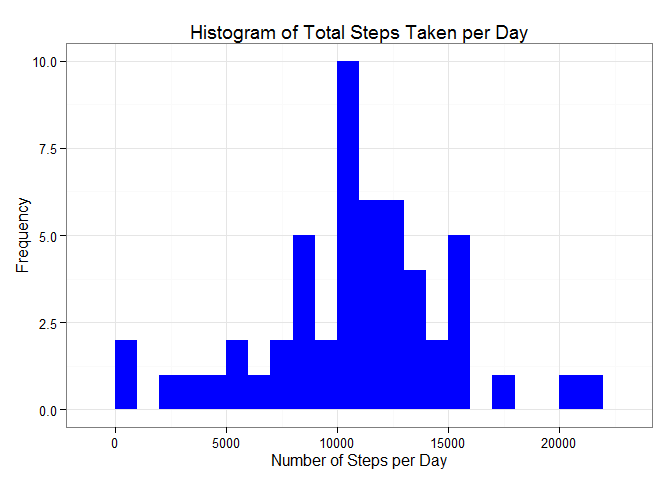
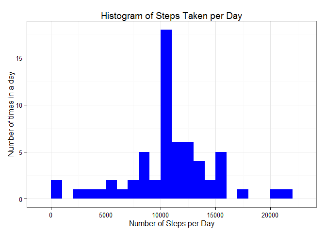

# Reproducible Research: Peer Assessment 1
## Prepare the R global envirnoment.


```r
library(knitr)
library(data.table)
library(ggplot2)
opts_chunk$set(echo = TRUE, results = 'hold')
```


## Loading and preprocessing the data

### Load the required data

The following statement is used to load the data using read.csv().

Note: It is assumed that the file activity.csv is in the current working directory.


```r
data <- read.csv("activity.csv", header = TRUE, sep = ",", colClasses=c("numeric", "character", "numeric"))
```

### Preprocessing of data (Cleaning) and previewing data

we will first convert the date to date class and interval to factor calss


```r
data$date <- as.Date(data$date, format = "%Y-%m-%d")
data$interval <- as.factor(data$interval)
str(data)
```

```
## 'data.frame':	17568 obs. of  3 variables:
##  $ steps   : num  NA NA NA NA NA NA NA NA NA NA ...
##  $ date    : Date, format: "2012-10-01" "2012-10-01" ...
##  $ interval: Factor w/ 288 levels "0","5","10","15",..: 1 2 3 4 5 6 7 8 9 10 ...
```


## What is mean total number of steps taken per day?

Now we will calculate the total number of steps per day


```r
Total_steps_day <- aggregate(steps ~ date, data, sum)
colnames(Total_steps_day) <- c("date","steps")
head(Total_steps_day)
```

```
##         date steps
## 1 2012-10-02   126
## 2 2012-10-03 11352
## 3 2012-10-04 12116
## 4 2012-10-05 13294
## 5 2012-10-06 15420
## 6 2012-10-07 11015
```

1). Now plot a histogram of the total steps taken per day


```r
ggplot(Total_steps_day, aes(x = steps)) + 
       geom_histogram(fill = "blue", binwidth = 1000) + 
        labs(title="Histogram of Total Steps Taken per Day", 
             x = "Number of Steps per Day", y = "Frequency") + theme_bw()
```

 

2). Now we will calculate the mean number of steps taked per day


```r
mean   <- mean(Total_steps_day$steps, na.rm=TRUE)
```
The mean number of steps taken per day is 1.0766189\times 10^{4}

## What is the average daily activity pattern?

Let us examine the steps per interval


```r
steps_per_interval <- aggregate(data$steps, 
                                by = list(interval = data$interval),
                                FUN=mean, na.rm=TRUE)

steps_per_interval$interval <- 
        as.integer(levels(steps_per_interval$interval)[steps_per_interval$interval])
colnames(steps_per_interval) <- c("interval", "steps")
```

Let us now see the steps per interval


```r
ggplot(steps_per_interval, aes(x=interval, y=steps)) +   
        geom_line(color="orange", size=1) +  
        labs(title="Average Daily Activity Pattern", x="Interval", y="Number of steps") +  
        theme_bw()
```

 

```r
max_inter <- steps_per_interval[which.max(  
        steps_per_interval$steps),]
```


## Imputing missing values

Let us now see how many data is missing


```r
missing <- sum(is.na(data$steps))
```

Total number of missing values are 2304

One of the converntional approch to fill the missing value is to replace missing values with mean value


```r
na_fill <- function(data1, pervalue) {
        na_index <- which(is.na(data1$steps))
        na_replace <- unlist(lapply(na_index, FUN=function(idx){
                interval = data1[idx,]$interval
                pervalue[pervalue$interval == interval,]$steps
        }))
        fill_steps <- data1$steps
        fill_steps[na_index] <- na_replace
        fill_steps
}

data_fill <- data.frame(  
        steps = na_fill(data, steps_per_interval),  
        date = data$date,  
        interval = data$interval)
str(data_fill)
missing1 <- sum(is.na(data_fill$steps))
```

```
## 'data.frame':	17568 obs. of  3 variables:
##  $ steps   : num  1.717 0.3396 0.1321 0.1509 0.0755 ...
##  $ date    : Date, format: "2012-10-01" "2012-10-01" ...
##  $ interval: Factor w/ 288 levels "0","5","10","15",..: 1 2 3 4 5 6 7 8 9 10 ...
```

Filled data contain 0 missing values

let us now examine the filled data by plotting histogram


```r
fill_steps_per_day <- aggregate(steps ~ date, data_fill, sum)
colnames(fill_steps_per_day) <- c("date","steps")

##plotting the histogram
ggplot(fill_steps_per_day, aes(x = steps)) + 
       geom_histogram(fill = "blue", binwidth = 1000) + 
        labs(title="Histogram of Steps Taken per Day", 
             x = "Number of Steps per Day", y = "Number of times in a day") + theme_bw() 
```

 

```r
steps_mean_fill   <- mean(fill_steps_per_day$steps, na.rm=TRUE)
```
The mean steps per day is 1.0766189\times 10^{4}.

## Are there differences in activity patterns between weekdays and weekends?


